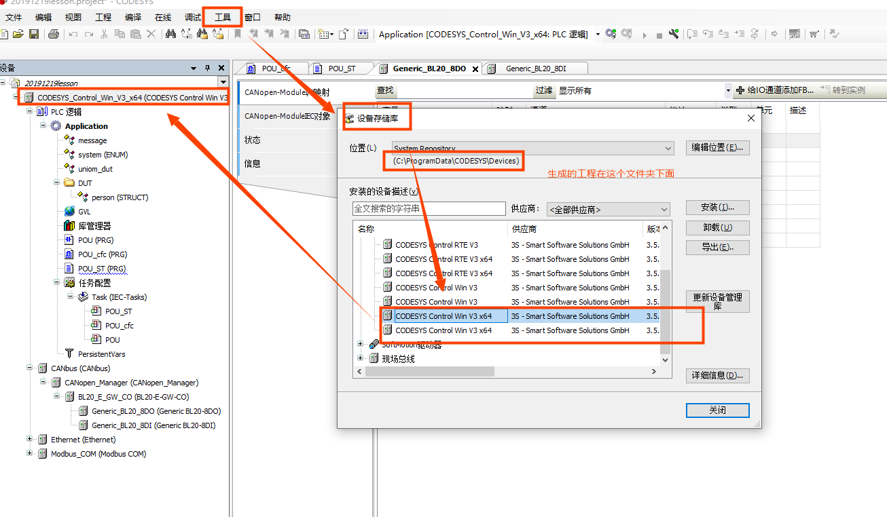

##### codesysIDE培训

培训分为两部分即Runtime system培训---主要是驱动移植 ,参加了IDE培训,主要是ST语言学习和梯形图学习, 其中ST语言复杂运动控制以及机器人运动控制使用,梯形图为简单的逻辑使用.  小型是PLC逻辑运算的, 大型的就是运动控制器codesys-runtime-st语言,

runtime系统可以运行在x86和arm_linux平台上,即控制器, 

codesys提供各种总线协议(ethercat modbus can/canopen), 支持各种库, codesys支持linux的多核, 提高CPU的利用率,windows不支持. 其中需要linux打实时补丁,烧录codesys进行控制.

本次购买了codesys的targetVLSU可视化;开发包一次性购买, 总线一次性购买

codesys主要应用于:CNC的G代码,手写,图纸导入

PLCopen

1.建立codesys工程:

文件---新建---Empty_Project  设置项目名称,保存路径

2.更改语言: 工具---选项---语言设置---与windows相同的语言

